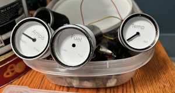
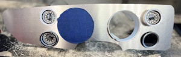

# MGB Dash 2026

CAN bus dashboard controller for a Nissan Leaf EV conversion in an MGB body. Seven modules communicate over a single shared CAN bus: three servo gauges (fuel/amps/temp), a speedometer, a body controller, a primary display, and a GPS display. A phone app connects over BLE, and a test Pi provides CLI diagnostic tools.

## Architecture





```
                            ┌─────────────────────────────┐
                            │      Leaf EV-CAN Bus        │
                            │   500 kbps · 11-bit IDs     │
                            └──────────┬──────────────────┘
                                       │
           ┌──────────┬──────────┬─────┴─────┬──────────┬──────────┬──────────┐
           │          │          │           │          │          │          │
      ┌────┴────┐┌────┴────┐┌───┴───┐┌─────┴─────┐┌───┴───┐┌────┴────┐┌────┴────┐
      │  FUEL   ││  AMPS   ││ TEMP  ││   SPEED   ││ BODY  ││  DASH   ││  GPS    │
      │ Servo   ││ Servo   ││ Servo ││Speedometer││ Ctrl  ││Primary  ││Display  │
      │ Gauge   ││ Gauge   ││ Gauge ││           ││       ││Display  ││         │
      │         ││         ││       ││           ││       ││         ││         │
      │ ESP32   ││ ESP32   ││ ESP32 ││  ESP32    ││ ESP32 ││  Pi 4B  ││ Pi 3B   │
      │ TJA1050 ││ TJA1050 ││TJA1050││ TJA1050  ││TJA1050││USB2CAN  ││USB2CAN  │
      │ Servo   ││ Servo   ││ Servo ││ Stepper   ││ GPIO  ││3.4" DSI ││ 2" LCD  │
      │ 24 LEDs ││ 24 LEDs ││24 LEDs││ OLED      ││ Hall  ││         ││ NEO-6M  │
      │         ││         ││       ││ Servo     ││ BLE   ││         ││         │
      └─────────┘└─────────┘└───────┘│ LEDs      │└───┬───┘└─────────┘└─────────┘
                                     └───────────┘    │
                                                      │ BLE
                                                 ┌────┴────┐
                                                 │  Phone  │
                                                 │  App    │
                                                 │  (PWA)  │
                                                 └─────────┘
```

All ESP32 modules use TWAI (built-in CAN controller) with a TJA1050 external transceiver. Both Raspberry Pis use Innomaker USB2CAN adapters (gs_usb/SocketCAN). The Leaf drivetrain is 2013 (AZE0), the battery is 2014 (also AZE0) — same CAN protocol.

### Bus Topology

Single shared bus. All devices sit directly on the Leaf EV-CAN. Custom dashboard messages coexist with Leaf-native traffic. Estimated bus load is ~28%. Custom CAN IDs occupy the 0x700–0x73F range, which is above all Leaf EV-CAN IDs (~0x5C0) and below OBD-II (0x7DF).

### Safety Mitigations

- **TX ID range guard** — ESP32 firmware blocks transmit of any CAN ID outside 0x700–0x73F, preventing accidental corruption of Leaf bus traffic
- **Bus-off recovery** — Automatic detection and recovery with backoff
- **Heartbeat monitoring** — Primary display tracks all module heartbeats, alerts on timeout
- **Hazard detection** — Body controller state machine detects simultaneous left+right turn signals and broadcasts HAZARD flag instead of individual signals

---

## Modules

| Module | Hardware | Path | Description |
|--------|----------|------|-------------|
| [Fuel Gauge](esp32/src/servo_gauge/README.md) | ESP32 + servo + 12 LEDs | `esp32/` env: `servo_fuel` | Battery SOC on 180° servo needle with LED ring |
| [Amps Gauge](esp32/src/servo_gauge/README.md) | ESP32 + servo + 12 LEDs | `esp32/` env: `servo_amps` | Battery current (center-zero) with LED ring |
| [Temp Gauge](esp32/src/servo_gauge/README.md) | ESP32 + servo + 12 LEDs | `esp32/` env: `servo_temp` | Battery/inverter temperature with LED ring |
| [Speedometer](esp32/src/speedometer/README.md) | ESP32+OLED + stepper + servo | `esp32/` env: `speedometer` | Slot-machine speed drum, gear indicator, OLED odometer |
| [Body Controller](esp32/src/body_controller/README.md) | ESP32 + GPIO + hall sensor | `esp32/` env: `body_controller` | Sensor hub: speed, gear, odometer, BLE bridge |
| [Primary Display](python/primary-display/README.md) | Pi 4B + 3.4" DSI LCD | `python/primary-display/` | Main dash screen: pycairo + pygame, 5 contexts |
| [GPS Display](python/gps-display/README.md) | Pi 3B + 2" SPI LCD + NEO-6M | `python/gps-display/` | 24hr clock dial, sun/moon arcs, ambient light |
| [Phone App](phone-app/README.md) | Mobile browser | `phone-app/` | PWA with Web Bluetooth (scaffold) |
| [Diagnostic Tools](python/tools/README.md) | Any Pi + USB2CAN | `python/tools/` | CLI tools for CAN testing and diagnostics |
| [Pi Setup](pi-setup/README.md) | — | `pi-setup/` | Provisioning scripts for all Pis |

---

## CAN Bus

Full CAN protocol reference (payload layouts, bit flags, Leaf message decoding, message flow diagram) is in **[common/README.md](common/README.md)**.

Custom IDs use the **0x700–0x73F** range:

| ID | Name | Source | Rate |
|----|------|--------|------|
| `0x700` | HEARTBEAT | All modules | 1 Hz |
| `0x710` | BODY_STATE | Body Controller | 10 Hz |
| `0x711` | BODY_SPEED | Body Controller | 10 Hz |
| `0x712` | BODY_GEAR | Body Controller | 2 Hz |
| `0x713` | BODY_ODOMETER | Body Controller | 1 Hz |
| `0x720` | GPS_SPEED | GPS Display | 2 Hz |
| `0x721` | GPS_TIME | GPS Display | 2 Hz |
| `0x722` | GPS_DATE | GPS Display | 2 Hz |
| `0x723`–`0x725` | GPS_LAT/LON/ELEV | GPS Display | 2 Hz |
| `0x726` | GPS_AMBIENT_LIGHT | GPS Display | 2 Hz |
| `0x727` | GPS_UTC_OFFSET | GPS Display | 2 Hz |
| `0x730` | SELF_TEST | Any | On-demand |
| `0x731`–`0x732` | LOG / LOG_TEXT | All modules | On-event |

---

## Project Structure

```
mgb-dash-2026/
├── common/                     CAN definitions (single source of truth)
│   ├── can_ids.json            Master CAN ID definitions
│   ├── cpp/                    C++ headers (ESP32 firmware)
│   └── python/                 Python modules (auto-generated)
├── esp32/                      All ESP32 PlatformIO code
│   ├── platformio.ini          5 build environments
│   ├── src/                    servo_gauge/, speedometer/, body_controller/
│   └── lib/                    CanBus, Heartbeat, LedRing, ServoGauge, LeafCan, StepperWheel
├── python/
│   ├── primary-display/        Pi 4B — pycairo + pygame
│   ├── gps-display/            Pi 3B — Python + NEO-6M GPS
│   └── tools/                  CLI diagnostic tools + codegen
├── phone-app/                  PWA — Web Bluetooth (scaffold)
├── pi-setup/                   Pi provisioning scripts
└── docs/                       Images, pinout diagrams, vehicle specs
```

## Building

### ESP32 Firmware

```powershell
cd esp32
pio run                          # Build all 5 environments
pio run -e servo_fuel            # Build one environment
pio run -e servo_fuel -t upload  # Flash via USB
```

All three servo gauges share one codebase (`src/servo_gauge/main.cpp`) differentiated by build-time `GAUGE_ROLE` constant.

### Python

All Python packages use `uv` + `pyproject.toml`:

```powershell
cd python/primary-display
uv sync
uv run python main.py --source synthetic
```

After editing `common/can_ids.json`, regenerate Python modules:

```powershell
python python/tools/codegen.py
```

---

## Development Status

### Implemented

| Module | Status | Notes |
|--------|--------|-------|
| **Body Controller** | Bench-tested | GPIO signals confirmed (bench 2026-03-03), CAN broadcast live (0x710–0x713), hall sensor, gear estimation, odometer/NVS, hazard timing detection |
| **Servo Gauges (x3)** | All working | CAN decode per role, servo mapping, LED ring warnings, turn signal/hazard animations, ambient light, stale data detection. All 3 confirmed on CAN bus. Amps on ideaspark ESP32+OLED with OLED diagnostics. |
| **Speedometer** | Loop complete | Stepper needle (CAN-driven), servo gear indicator, turn signal/hazard LEDs, ambient light, self-test |
| **LeafCan decoder** | Complete | All 9 Leaf + Resolve CAN messages decoded |
| **Primary Display** | Phase 1+2 complete | pycairo+pygame, 5 contexts, alert system, CAN receive, clock sync |
| **GPS Display** | Fully ported | 24hr clock dial, sun/moon arcs, CAN broadcast (0x720–0x727), ambient light, backlight PWM |
| **Shared Libraries** | Complete | CanBus, Heartbeat, CanLog, LedRing, ServoGauge, StepperWheel, LeafCan |
| **Code Generator** | Complete | `python/tools/codegen.py`: JSON → Python modules + C++ headers |

### Not Yet Implemented

- Speedometer CAN — goes bus-off immediately, suspected loose wire from bench work
- Primary Display Phase 3 (ReplaySource)
- Waveshare DSI display — blocked, need 12cm same-side-contacts cable
- Phone app BLE and UI logic
- Tool scripts (stubs only — no python-can integration)
- CI/CD, testing infrastructure, git hooks
- Hardware integration testing

---

## Progress

### 2026-03-03 — Hardware bring-up session

- **Speedometer ESP32** — fully operational on bench. Stepper homes via optical interrupter, servo self-test runs, OLED diagnostic display shows state/MPH/gear/CAN stats, 1Hz LED heartbeat. Listens for CAN messages (0x710–0x713, 0x720, 0x726, 0x730).
- **Speedometer pinout** — remapped to ideaspark ESP32+OLED board. All 9 active signals on left side: CAN TX/RX adjacent (GPIO32/35), stepper IN1–IN4 consecutive matching ULN2003 header order (GPIO33/25/26/27), home sensor on GPIO34, servo on GPIO13. Pinout diagram regenerated.
- **OLED diagnostic display** — two-zone layout on integrated SSD1306 (128x64 I2C). Yellow band: state word (INIT/HOME/TEST/IDLE/RUN/ERR) + CAN RX count. Blue zone: MPH, gear, odometer, stepper position, firmware version. Splash screen at boot with role name + version for 2 seconds.
- **GPS display (Pi 3B)** — LCD working (Waveshare 1.28" GC9A01 round LCD, SPI). Service running: GPS fix acquired, 24hr clock rendering, CAN broadcasting on can0. Fixed missing `timezonefinder` dependency, restored deleted working tree files, fixed venv permissions.
- **Primary display (Pi 4B)** — boots reliably on HDMI after reboot. Fixed race condition: service now waits for X server readiness via `xset q` polling before starting pygame. Display engine selects HDMI over DSI (skips 800x800 DSI panel). Starts in idle context, listening on CAN bus for real data.
- **CAN bus on primary Pi** — created missing `/etc/network/interfaces.d/can0` config. Interface now comes up at 500 kbps with txqueuelen 1000 on boot.
- **PlatformIO build** — eliminated PIN_CAN_TX/PIN_CAN_RX/PIN_SERVO macro redefinition warnings across all 5 environments by extracting `[servo_pins]` section in platformio.ini.
- **Body controller bench-tested** — flashed and live on CAN bus. Signal discovery: prototype pin assignments were wrong for new wiring. Confirmed 5 signals (BRAKE=GPIO23, REVERSE=GPIO22, REGEN=GPIO21, LEFT_TURN=GPIO27, RIGHT_TURN=GPIO18) + HALL_SENSOR=GPIO35. 8 deferred signals commented out (KEY_ON, KEY_START, KEY_ACCESSORY, HAZARD, RUNNING_LIGHTS, HEADLIGHTS, FAN, CHARGE_PORT). CAN messages 0x710–0x713 broadcasting correctly. GPIO27 LEFT_TURN not reporting correctly — needs investigation.
- **GPS display blank-screen issue** — LCD backlight stays on but display goes blank after some time. Service still running, logs clean, CAN data still broadcasting. Suspected SPI wedge. Parked for now.
- **Pending** — CAN_H/CAN_L physical wiring between the two Pi USB2CAN adapters (both individually confirmed working). Waveshare 3.4" DSI display needs 12cm cable (current 160mm cable has wrong contact orientation).

### 2026-03-04 — Servo gauges: turn signal routing + LED ring debugging

- **Turn signal per-side routing** — Fuel (left column) now only responds to LEFT_TURN, Amps (right column) only responds to RIGHT_TURN, Temp ignores all turn/hazard signals. Each uses a half-ring amber blink at 1 Hz with ambient-matched intensity via new `LedRing::startPartialBlink()` method. Hazard still flashes all LEDs on Fuel and Amps.
- **LED ring partial blink** — new `startPartialBlink(startPixel, endPixel)` in LedRing library. 1 Hz on/off, amber color scaled by ambient brightness level. Pixel ranges defined as constants: right half = pixels 1–5, left half = pixels 7–11 (pixel 0 = 12 o'clock, clockwise). Ranges need confirmation once hardware signal integrity is resolved.
- **`setBrightness(128)` removed** — was causing phantom green LEDs on pixels that should be off. Prototype code never used `setBrightness()`; removing it fixed single-pixel test immediately. Root cause: NeoPixel's `setBrightness()` destructively modifies pixel buffer data.
- **LED ring model corrected** — rings are **SK6812 RGBW** (Adafruit #2852), not WS2812B. RGBW uses 4 bytes per pixel; the old `NEO_GRB` (3 bytes) caused shifted data after pixel 0, producing wrong colors on all subsequent pixels. Fixed: `NEO_GRBW + NEO_KHZ800`.
- **Hardware additions** — 330Ω series resistor on data line (GPIO14→DIN) + 100µF 20V electrolytic cap across VCC/GND installed. Good practice but were not the root cause.
- **Pixel mapping confirmed** — pixel 0 = 12 o'clock (red), pixel 3 = 3 o'clock (green), pixel 6 = 6 o'clock (blue), pixel 9 = 9 o'clock (yellow). Cardinal test passed, debug code removed, normal self-test restored.

### 2026-03-11 — Amps gauge fully working, OLED display improvements

- **Amps gauge CAN confirmed working** — root cause was a bad/malfunctioning TJA1050 transceiver breakout board. Replaced with known-good unit. All four subsystems now operational: OLED display, LED ring, servo, and CAN bus. All three servo gauges (Fuel, Amps, Temp) now have working CAN.
- **Amps log level** — filtered from DEBUG to INFO (`CORE_DEBUG_LEVEL=3`) to reduce serial output noise on the Amps module.
- **Amps INFO logging** — added ESP_LOGI messages for animation state changes (right turn on/off, hazard) and amps value changes with 2A dead-band to avoid log flooding.
- **OLED CAN counter (Amps + Speedometer)** — display now shows last 4 digits of CAN RX count (zero-padded, rolls 9999→0000) instead of unbounded full number that would outgrow the display.
