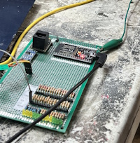

# Body Controller

Central sensor hub. Reads vehicle GPIO inputs (via resistor dividers from 12V signals), drives hall sensor speed measurement, estimates gear from motor RPM vs driveshaft RPM, persists odometer to NVS, and bridges to BLE for the phone app. ESP32 + TJA1050 CAN transceiver.



## Components

| Component | Part / Model | Interface | ESP32 Pin | Notes |
|-----------|-------------|-----------|-----------|-------|
| MCU | ESP32-WROOM-32 DevKit | — | — | BLE built-in |
| CAN Transceiver | TJA1050 | TWAI | TX→**GPIO12**, RX→**GPIO25** | Non-standard pins (not 5/4) |
| Hall Effect Sensor | A3144 or OH137 | Interrupt | **GPIO35** | Driveshaft, 2 magnets/rev, pull-up |
| Key On | Resistor divider | Digital In | **GPIO23** | 12V → 3.3V, active-high |
| Key Start | Resistor divider | Digital In | **GPIO22** | 12V → 3.3V, active-high |
| Key Accessory | Resistor divider | Digital In | **GPIO21** | 12V → 3.3V, active-high |
| Left Turn | Resistor divider | Digital In | **GPIO19** | 12V → 3.3V, active-high |
| Right Turn | Resistor divider | Digital In | **GPIO18** | 12V → 3.3V, active-high |
| Hazard Switch | Resistor divider | Digital In | **GPIO17** | 12V → 3.3V, active-high |
| Running Lights | Resistor divider | Digital In | **GPIO4** | 12V → 3.3V, active-high |
| Headlights | Resistor divider | Digital In | **GPIO32** | 12V → 3.3V, active-high |
| Brake | Resistor divider | Digital In | **GPIO26** | 12V → 3.3V, active-high |
| Regen Active | Resistor divider | Digital In | **GPIO27** | 12V → 3.3V, active-high |
| Fan Active | Resistor divider | Digital In | **GPIO14** | 12V → 3.3V, active-high |
| Reverse Gear | Resistor divider | Digital In | **GPIO16** | 12V → 3.3V, active-high |
| Charge Port | Resistor divider | Digital In | **GPIO5** | 12V → 3.3V, active-high |
| Voltage Regulator | LM2596 or similar | — | — | Vehicle 12V → 5V |
| CAN Termination | 120 ohm resistor | — | — | End-of-bus nodes only |

> **16 GPIOs used** — 2 CAN, 1 hall sensor, 13 resistor-divider inputs from 12V signals.

## CAN Messages

| Direction | CAN ID | Name | Rate |
|-----------|--------|------|------|
| Consumes | `0x1DA` | LEAF_MOTOR_STATUS | — |
| Consumes | `0x730` | SELF_TEST | On-demand |
| Broadcasts | `0x700` | HEARTBEAT | 1 Hz |
| Broadcasts | `0x710` | BODY_STATE | 10 Hz |
| Broadcasts | `0x711` | BODY_SPEED | 10 Hz |
| Broadcasts | `0x712` | BODY_GEAR | 2 Hz |
| Broadcasts | `0x713` | BODY_ODOMETER | 1 Hz |

See [common/README.md](../../../common/README.md) for full payload details.

## Behavior

- **`0x710` BODY_STATE**: Packs all inputs into byte 0 + byte 1 bit flags. Hazard detection state machine: if left and right turn signals activate within a few ms, broadcasts HAZARD bit instead of individual LEFT+RIGHT.
- **`0x711` BODY_SPEED**: Authority source for vehicle speed. Computed from hall sensor pulse timing using build-time constants for differential ratio (3.909) and tire diameter (26.5"). Two magnets per rev for double resolution + balance.
- **`0x712` BODY_GEAR**: Compares motor RPM from Leaf `0x1DA` against driveshaft RPM (from hall sensor) to estimate which of the MGB's 4-speed gears is engaged. Gear ratios: 1st=3.41, 2nd=2.166, 3rd=1.38, 4th=1.00, Rev=3.09, with ±15% tolerance band. Unknown = 0xFF.
- **`0x713` BODY_ODOMETER**: 32-bit unsigned miles (little-endian). Persisted to ESP32 NVS every 0.5 mile.
- **BLE**: Acts as Bluetooth LE peripheral, exposing vehicle data for the phone app.

## Build

```powershell
cd esp32
pio run -e body_controller
pio run -e body_controller -t upload   # Flash via USB
```

## Pinout

- [Pinout diagram (PNG)](../../../docs/body_controller-pinout.png)
- [Pinout table (Markdown)](../../../docs/body-controller-pinout.md)
