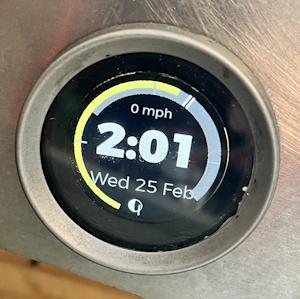

# GPS Display

GPS receiver, time source, ambient light calculator, and astronomical display. Raspberry Pi 3B + Waveshare 2" Round LCD (240x240 SPI) + NEO-6M GPS module. Broadcasts GPS data and ambient light category over CAN for all other modules.



## Components

| Component | Part / Model | Interface | Pi GPIO | Notes |
|-----------|-------------|-----------|---------|-------|
| SBC | Raspberry Pi 3B | — | — | |
| Display | Waveshare 2" Round LCD | SPI | MOSI→**GPIO10**, SCLK→**GPIO11**, CS→**GPIO8**, DC→**GPIO25**, RST→**GPIO27**, BL→**GPIO18** | SPI0, GC9A01 240x240, backlight PWM |
| GPS Receiver | NEO-6MV2 (u-blox) | UART | TX→**GPIO15** (RXD0), RX→**GPIO14** (TXD0) | 9600 baud, with ceramic antenna |
| CAN Adapter | Innomaker USB2CAN | USB | USB-A port | gs_usb driver, SocketCAN |
| Storage | MicroSD 16GB+ Class 10 | — | MicroSD slot | |
| Power | 5V 2.5A Micro-USB supply | — | Micro-USB port | Delayed shutdown after key-off |

> **GPIO pin map (BCM numbering):** SPI0 for display (GPIO 8, 10, 11 + GPIO 18, 25, 27 for control). UART0 for GPS (GPIO 14, 15). Bluetooth disabled via `dtoverlay=disable-bt` to free PL011 UART.

## CAN Messages

| Direction | CAN ID | Name | Rate |
|-----------|--------|------|------|
| Consumes | `0x730` | SELF_TEST | On-demand |
| Broadcasts | `0x700` | HEARTBEAT | 1 Hz |
| Broadcasts | `0x720` | GPS_SPEED | 2 Hz |
| Broadcasts | `0x721` | GPS_TIME | 2 Hz |
| Broadcasts | `0x722` | GPS_DATE | 2 Hz |
| Broadcasts | `0x723` | GPS_LATITUDE | 2 Hz |
| Broadcasts | `0x724` | GPS_LONGITUDE | 2 Hz |
| Broadcasts | `0x725` | GPS_ELEVATION | 2 Hz |
| Broadcasts | `0x726` | GPS_AMBIENT_LIGHT | 2 Hz |
| Broadcasts | `0x727` | GPS_UTC_OFFSET | 2 Hz |

See [common/README.md](../../common/README.md) for full payload details.

## Behavior

- **GPS**: NEO-6MV2 over UART at 9600 baud via gpsd daemon. On first fix, sets Pi system time from GPS.
- **Display before fix**: "Waiting on Fix..."
- **Display after fix**: 24-hour rim (noon top, midnight bottom), yellow sunrise→sunset arc, dark blue sunset→sunrise with twilight gradients. White inner border where moon is above horizon. Center: moon phase icon, bold HH:MM time, day of week.
- **Almanac**: sunrise/sunset/moonrise/moonset/moon phase computed locally from GPS lat/lon + date using suncalcPy2 — no internet required.
- **Ambient light** (`0x726`): DAYLIGHT (0), EARLY_TWILIGHT (1), LATE_TWILIGHT (2), DARKNESS (3). Computed from current time relative to sunset. All gauge modules consume this for LED backlight level.
- **Backlight PWM**: Maps ambient light category to display PWM duty: DAYLIGHT=100%, EARLY_TWILIGHT=70%, LATE_TWILIGHT=40%, DARKNESS=15%.
- **UTC offset** (`0x727`): Broadcasts signed UTC offset in minutes so the primary display can sync its system clock.

## Run

```bash
python python/gps-display/main.py
```

Runs as `mgb-gps-display.service` on the Pi (see [`pi-setup/gps-display.sh`](../../pi-setup/gps-display.sh)).

## Pinout

[GPS display pinout](../../docs/gps_display-pinout.png)
