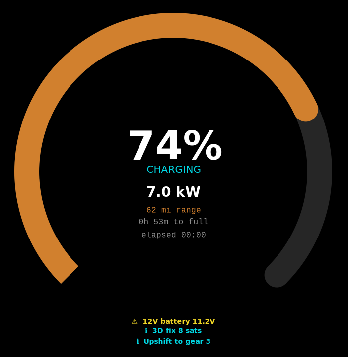
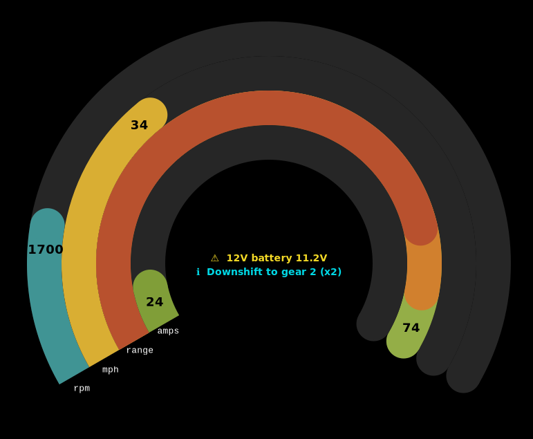
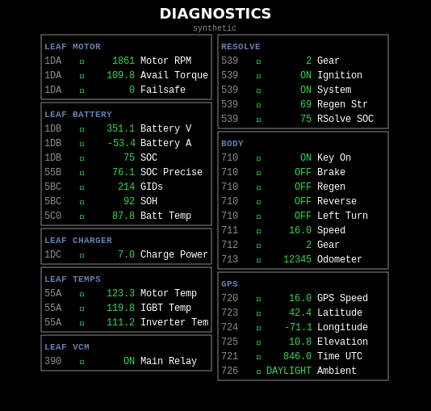

# Primary Display

Main dashboard screen. Raspberry Pi 4B + Waveshare 3.4" Round DSI LCD (800x800). Rendered with pycairo + pygame, GPU-accelerated via kmsdrm. Five auto-switching contexts based on vehicle state, plus an alert system.

  

## Components

| Component | Part / Model | Interface | Pi Connection | Notes |
|-----------|-------------|-----------|---------------|-------|
| SBC | Raspberry Pi 4B (4GB+) | — | — | 64-bit Pi OS required |
| Display | Waveshare 3.4" Round DSI LCD | DSI | DSI ribbon cable | 800x800, 10-point capacitive touch |
| CAN Adapter | Innomaker USB2CAN | USB | USB-A port | gs_usb driver, SocketCAN |
| Storage | MicroSD 32GB+ Class 10 | — | MicroSD slot | |
| Power | 5V 3A USB-C supply | — | USB-C port | Delayed shutdown after key-off |

> **No GPIO pins consumed.** Display uses DSI ribbon, CAN uses USB, touch is integrated with the display.

## CAN Messages

| Direction | CAN ID | Name | Rate |
|-----------|--------|------|------|
| Consumes | `0x700` | HEARTBEAT | 1 Hz |
| Consumes | `0x710` | BODY_STATE | 10 Hz |
| Consumes | `0x711` | BODY_SPEED | 10 Hz |
| Consumes | `0x713` | BODY_ODOMETER | 1 Hz |
| Consumes | `0x727` | GPS_UTC_OFFSET | 2 Hz |
| Consumes | `0x1DB` | LEAF_BATTERY_STATUS | — |
| Consumes | `0x1DC` | LEAF_CHARGER_STATUS | — |
| Consumes | `0x55A` | LEAF_INVERTER_TEMPS | — |
| Consumes | `0x55B` | LEAF_SOC_PRECISE | — |
| Consumes | `0x5BC` | LEAF_BATTERY_HEALTH | — |
| Consumes | `0x5C0` | LEAF_BATTERY_TEMP | — |
| Consumes | `0x726` | GPS_AMBIENT_LIGHT | 2 Hz |
| Broadcasts | `0x700` | HEARTBEAT | 1 Hz |

See [common/README.md](../../common/README.md) for full payload details.

## Contexts

Auto-switching based on vehicle state:

| Context | Trigger | Description |
|---------|---------|-------------|
| **Startup** | Boot | "MGB DASH 2026" splash. Transitions to Idle after 3 s. |
| **Driving** | speed > 1 mph (2 s) | Three concentric arc gauges (speed/amps/range), 220° sweep, center speed readout, alerts in bottom gap. |
| **Idle** | speed = 0 (10 s) | Large SOC%, range estimate, elapsed time since key_on, odometer. |
| **Charging** | charge > 0.5 kW (3 s) | SOC arc gauge (270°), charge power (kW), estimated time to full. Returns to Idle when charge = 0 (5 s). |
| **Diagnostics** | Manual toggle | Full signal grid with freshness colors, group headers, heartbeat bar, scroll. |

### Alert System

Bottom third of driving context. Shows alerts at or above configurable severity (DEBUG/INFO/WARN/ERROR/CRITICAL). Auto-acknowledged after 10 seconds. Sources:

- Missing heartbeats (module offline)
- Battery temperature > 45 °C
- Motor temperature > 120 °C
- No GPS fix

## Remote Control via Signals

The display engine registers Unix signal handlers for remote control over SSH:

```bash
# Find the PID
PID=$(ps aux | grep 'python.*main.py' | grep -v grep | awk '{print $2}')

# Toggle diagnostics view on/off
kill -USR2 $PID

# Save screenshot to /tmp/mgb-screenshot.png
kill -USR1 $PID
```

| Signal | Action |
|--------|--------|
| `SIGUSR1` | Save screenshot to `/tmp/mgb-screenshot.png` |
| `SIGUSR2` | Toggle diagnostics context on/off |

## Keyboard Shortcuts

When the pygame window has focus: `d` toggles diagnostics, `Escape` quits.

## Run

```powershell
# Synthetic data (dev/test)
python python/primary-display/main.py --source synthetic --scenario driving

# Live CAN bus
python python/primary-display/main.py --source can
```

Options: `--source`, `--scenario`, `--speed`, `--context`, `--width`, `--height`.

## Pinout

[Primary display pinout](../../docs/primary_display-pinout.png)
